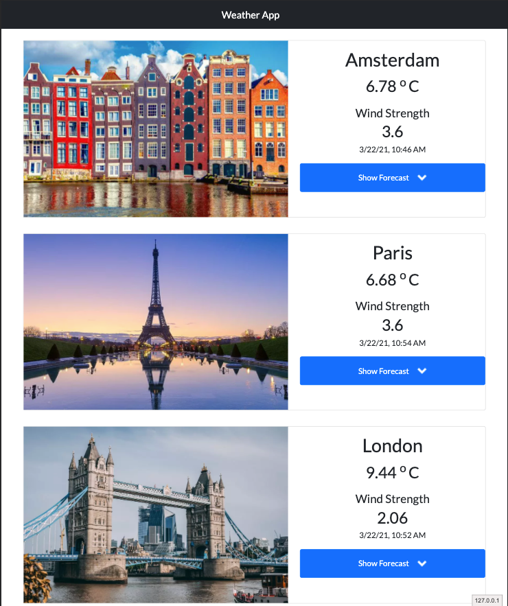

<!-- PROJECT LOGO -->
<br />
<p align="center">
  <a href="https://github.com/toybz/weather-app">
    
  </a>

<h3 align="center">Angular Weather App</h3>

  <p align="center">
    An Angular Weather App that displays weather conditions and forecasts for selected cities. This project uses the Openweather endpoints.
   </p>

<p align="center">
<a href="https://euro-weather-app.netlify.app/" >View Demo</a>
</p>


<!-- TABLE OF CONTENTS -->
<details open="open">
  <summary>Table of Contents</summary>
  <ol>
    <li>
      <a href="#about-the-project">About The Project</a>
      <ul>
        <li><a href="#built-with">Built With</a></li>
      </ul>
    </li>
    <li>
      <a href="#getting-started">Getting Started</a>
      <ul>
        <li><a href="#prerequisites">Prerequisites</a></li>
        <li><a href="#installation">Installation</a></li>
      </ul>
    </li>
    <li><a href="#usage">Usage</a></li>
    <li><a href="#contributing">Contributing</a></li>
    <li><a href="#contact">Contact</a></li>
    <li><a href="#acknowledgements">Acknowledgements</a></li>
  </ol>
</details>


<!-- ABOUT THE PROJECT -->
## About The Project
The goal of this weather app is to  display weather conditions and forecasts  for Selected cities.  

### Built With


* [Angular](https://angular.io/)
* [Bootstrap](https://getbootstrap.com)
* [OpenWeather API](https://openweathermap.org)


<!-- GETTING STARTED -->
## Getting Started

To get a local copy up and running follow the steps below

### Prerequisites

* Get an API Key from [OpenWeather API](https://openweathermap.org)

### Installation

1. Clone the repo
   ```sh
   git clone https://github.com/toybz/weather-app.git
   ```
2. Install NPM packages
   ```sh
   npm install
   ```
3. Enter your OpenWeather API Key  in the `environment.ts` file
   ```JS
    weatherAppId : 'xxxxxxxxxxxxxxxx'
   ```
2. Serve 
   ```sh
   npm run serve --open
   ```

## Usage

When served, the Landing page will display the current weather for 5 cities. To get the forecasts for a city, click on the
'Show Forecast' button. 


<!-- CONTACT -->
## Contact

Email - [toyeeb.rahmon@outlook.com](toyeeb.rahmon@outlook.com) 

Project Link: [https://github.com/toybz/weather-app](https://github.com/toybz/weather-app)


